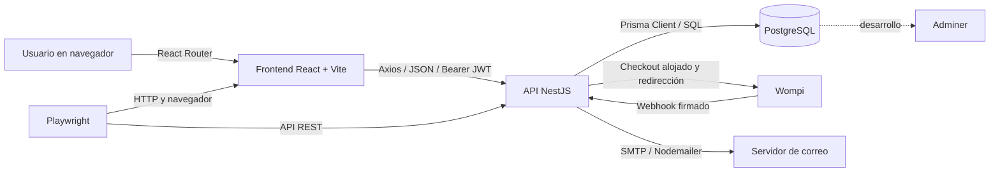

# Módulos integrados y contratos de datos de RM Parking

**Tipo de documento:** catálogo técnico de integraciones y componentes

**Fecha de revisión del código:** 29 de septiembre de 2026

**Alcance:** funcionalidades presentes en el repositorio. Las capacidades descritas como propuestas o no implementadas se identifican expresamente.

## 1. Propósito y criterio de lectura

Este documento identifica los módulos de Backend, las áreas del Frontend, sus integraciones internas y externas, y los datos que reciben y producen. La descripción se basa en las rutas, controladores, DTO, servicios y modelos presentes en el código. Para configuración de servidores, comandos y entornos, consultar [manual técnico.md](manual%20t%C3%A9cnico.md).

Los nombres de rutas se expresan relativos a la raíz HTTP del Backend. No hay prefijo global `/api`; la única ruta Swagger sí está publicada en `/api/docs`.

## 2. Arquitectura e integración general

### 2.1 Inventario de integraciones

| Integración | Tipo | Origen y destino | Datos principales | Estado verificable |
|---|---|---|---|---|
| Frontend–Backend | API REST sobre HTTP/JSON | React/Axios → NestJS | DTO JSON, parámetros de consulta, JWT Bearer, respuestas JSON y archivos | Implementada. Base URL configurable con `VITE_API_URL`; valor local predeterminado en código `http://localhost:3000`. |
| Backend–PostgreSQL | Persistencia relacional mediante Prisma ORM | Servicios NestJS → Prisma Client → PostgreSQL | Usuarios, sedes, vehículos, tickets, salidas, pagos, contratos, asistencia, permisos, auditoría y configuración | Implementada mediante `DATABASE_URL`. |
| Backend–Wompi | Pasarela de pago alojada: URL de checkout y webhook de retorno | Backend → navegador/Wompi; Wompi → `POST /payments/wompi/webhook` | Referencia, importe en centavos COP, método, URL de retorno y firma | Código implementado para checkout y recepción de eventos. El proyecto la identifica como Sandbox; no se encontró configuración de producción validada. La prueba de navegador intercepta API/proveedor y no valida el webhook real. |
| Backend/Frontend–QR Server | Servicio externo de generación de imagen QR | Backend construye una URL de imagen `api.qrserver.com`; el navegador la descarga | URL de la página `/pago/:paymentId` codificada en el parámetro `data` | Implementada al construir la respuesta de intención. El identificador de pago queda incluido en la URL que recibe el proveedor externo. |
| Backend–SMTP | Correo saliente para recuperación de contraseña | Nodemailer → servidor SMTP | Destinatario, código temporal y vencimiento | Condicional a `SMTP_HOST`, `SMTP_PORT` y, cuando aplique, credenciales. Sin transporte, el envío falla y existe respuesta de depuración solo en desarrollo. |
| Frontend–almacenamiento local | Persistencia de sesión en el navegador | `AuthContext`/Axios ↔ `localStorage` | JWT bajo `token`; vencimiento local bajo `session_expires_at` | Implementada. El Backend no expone endpoint de renovación de token. |
| Frontend–eventos de actualización | Integración local dentro de la SPA | Interceptor Axios → evento DOM `rmparking:data-updated` → paneles suscritos | Método HTTP, URL y estado | Implementada para notificar cambios exitosos de POST/PUT/PATCH/DELETE y refrescar vistas. |
| Playwright–aplicación | Automatización E2E y pruebas de API | QA → navegador Chromium, Frontend y API | Variables `QA_API_URL`, `QA_ADMIN_EMAIL`, `QA_ADMIN_PASSWORD` opcionales | Implementada para pruebas locales. El workflow CI actual no ejecuta la carpeta QA. |
| Adminer–PostgreSQL | Herramienta web de administración de BD | Navegador → Adminer → servicio Compose `db` | Credenciales PostgreSQL | Disponible solo por la configuración de Docker Compose; no es parte del flujo funcional de usuario. |

### 2.2 Integraciones que no deben darse por implementadas

- No se encontró integración implementada de reconocimiento de placas/LPR, cámaras, barreras, impresoras, lectores físicos ni aplicación móvil.
- El `PROJECT_BRIEF.md` plantea IA, predicción y anomalías como visión de producto; no se localizaron servicios o módulos de IA conectados.
- La configuración guarda campos genéricos como `integraciones.pasarelaPago`, `apiKeyPagos` y `webhookVigilancia`; esos campos no constituyen por sí mismos conectores ejecutables. La integración efectiva de pagos está codificada en `PaymentsModule` y sus variables de entorno.
- Se pueden configurar flags de tarjeta y pago en línea; esto no prueba que exista procesamiento directo de tarjeta fuera del checkout Wompi. El checkout público enumera `NEQUI`, `CARD` y `BANK_ACCOUNT`.
- No hay SDK de Wompi en las dependencias ni llamada server-to-server para crear transacciones: el Backend construye una URL de checkout y recibe el webhook.
- La imagen del QR no se renderiza localmente: el Backend entrega una URL de `api.qrserver.com` con la página pública de pago como contenido. La carga de esa imagen comparte esa URL con un proveedor externo.

## 3. Módulos Backend y acoplamientos

El `AppModule` registra diez módulos Nest funcionales/técnicos: `DatabaseModule`, `AuthModule`, `ParkingModule`, `UsersModule`, `ClientsModule`, `SettingsModule`, `PermissionsModule`, `AuditModule`, `ReportsModule` y `PaymentsModule`. `AppController` y `AppService` exponen además la raíz técnica.

| Módulo/componente | Responsabilidad | Integraciones internas | Entradas principales | Salidas principales |
|---|---|---|---|---|
| `AppModule` / `AppController` | Composición de la API, limitación de solicitudes y ruta de raíz | Registra todos los módulos, `ThrottlerModule` y guardia global de throttling | Solicitudes HTTP; ventanas de 60 s, límites general 30 y autenticación 10 | Respuestas de módulos; ruta raíz de estado descriptivo y respuesta de favicon. |
| `DatabaseModule` / `PrismaService` | Conexión y ciclo de vida de la BD | Prisma Client, PostgreSQL y `DATABASE_URL` | Configuración de conexión del proceso | Operaciones Prisma; abre conexión al iniciar y la cierra al detener Nest. |
| `AuthModule` | Registro, login, perfil, logout, asistencia y recuperación de contraseña | Prisma (`User`/`Attendance`), JWT/Passport, `PermissionsService` exportado por `PermissionsModule` global, `AuditModule` global y `PasswordRecoveryNotifierService` | `RegisterDto`, `LoginDto`, token Bearer, correo, código y nueva contraseña | JWT de 10 horas, perfil con claves de permisos efectivos, estado de asistencia, confirmación y mensajes de recuperación. |
| `ParkingModule` | Sedes, tarifas, ingreso, salida, tickets y cierre de jornada | Prisma, permisos, guardias y auditoría; `PaymentsModule` consume salidas para cobrar | Placa, tipo de vehículo, `parkingId`, configuración de sede/tarifas e identificadores | Ticket y vehículo, resumen de activos/cerrados, salida, duración, total, opciones de pago y estado de jornada. |
| `UsersModule` | Administración de cuentas internas | Prisma, hash bcrypt, JWT/RBAC, permisos por pantalla y auditoría | Datos de usuario, filtros, rol, estado e identificador | Usuario/lista filtrada; confirmaciones de archivo y restauración. |
| `ClientsModule` | Cliente y contrato mensual, filtros, alertas y renovaciones | Prisma, sedes, autenticación/RBAC, permisos y auditoría | Datos personales/documentales, sede, vigencia, mensualidad, filtros y cambios | Contrato con usuario/sede/alertas; alertas; renovación; resultado de archivo/restauración. |
| `SettingsModule` | Configuración general, medios de pago y tarifas | Prisma, sedes/tarifas, permisos y auditoría | Capacidad, horarios, tarifas especiales, políticas, mensajes, flags de pago, seguridad e integraciones descriptivas | Configuración, parqueaderos y tarifas; configuración actualizada. |
| `PermissionsModule` | Permisos de pantalla efectivos por rol y usuario | Prisma, `RolesGuard`, `RequireScreenPermission`, `Users` y auditoría | Rol, usuario, lista `{screenKey, canView}` | Pantallas activas, permisos de rol/usuario y claves de pantalla permitidas. |
| `AuditModule` | Trazabilidad operativa y de seguridad | Prisma; recibe llamadas de los controladores y guardias | Evento de auditoría, contexto HTTP, filtros, paginación y formato | Página de registros, detalle, CSV/JSON y metadatos. Implementa retención configurable. |
| `ReportsModule` | Indicadores y exportaciones | Prisma, pagos, contratos, asistencia, sedes, permisos y auditoría | Rangos/periodos, cliente, estado de mensualidad, usuario, documento y tipo/formato | Agregados de operación/ingresos, listas de opciones y archivos XLSX/PDF/DOCX. |
| `PaymentsModule` | Cobro en efectivo y checkout digital de salidas | Prisma, configuración de métodos de pago, Wompi y auditoría | ID de salida/pago, método público, datos opcionales del pagador y webhook firmado | Intento de pago, URL checkout, estado del pago, registro efectivo y cierre de ticket tras confirmación. |
| `Common` | Utilidades y políticas HTTP transversales | Todos los controladores/guardias | Metadata de roles/pantalla, DTO, excepción, solicitud | `RolesGuard`, filtro común de errores, decoradores, normalización de códigos numéricos. |

`DatabaseModule` exporta `PrismaService`. `PermissionsModule` y `AuditModule` están marcados `@Global()` y exportan `PermissionsService` y `AuditService`; varios controladores/guardias los consumen sin importarlos de forma local en cada módulo. Los módulos de dominio declaran sus controladores, servicios y guardias en sus respectivos `*.module.ts`; revisar esos archivos al cambiar providers o límites de módulo.

### 3.1 Rutas HTTP y contratos por módulo

Todas las rutas de dominio usan validación global: propiedades desconocidas se rechazan, se transforman DTO y se eliminan propiedades no decoradas. Las salidas de error se procesan por `AllExceptionsFilter`; el éxito depende del endpoint y se indica en las tablas.

#### Aplicación y acceso

| Método y ruta | Protección | Entrada | Salida |
|---|---|---|---|
| `GET /` | Pública | Ninguna | Estado/mensaje de la aplicación. |
| `GET /favicon.ico` | Pública | Ninguna | Respuesta de favicon. |
| `POST /auth/register` | Pública; throttling `auth` | `fullName`, `email`, `password`; `role` opcional | `{message, userId}`. El DTO permite un rol opcional; el servicio lo usa al crear la cuenta. |
| `POST /auth/login` | Pública; throttling `auth` | `{email, password}` | `{accessToken, attendanceId, checkIn, attendanceAction}`; registra acceso/fracaso y, si corresponde, inicio de asistencia. |
| `GET /auth/me` | JWT | Bearer JWT | Perfil sin hash: ID, correo, nombre, rol, estado, documento, fechas de alta/cambio y arreglo `permissions` con claves efectivas. |
| `POST /auth/logout` | JWT | Bearer JWT | Resultado de cierre y datos de asistencia cerrada, si existía. |
| `POST /auth/password/request` | Pública; throttling `auth` | `{email}` | Mensaje genérico; en desarrollo sin SMTP puede incluir `debugCode`, nunca debe considerarse comportamiento de producción. |
| `POST /auth/password/reset` | Pública; throttling `auth` | `{email, code, newPassword}` | Confirmación de cambio; el código es temporal, hasheado y de un solo uso. |

#### Operación de parqueaderos

| Método y ruta | Protección | Entrada | Salida |
|---|---|---|---|
| `POST /parking` | JWT; SUPER_ADMIN/ADMIN_PARKING; permiso `settings-config` | `{nombre, direccion, capacidad, tarifaBase, activo?, tiposVehiculo?, horario?}` | Sede creada con identificador y configuración. |
| `PATCH /parking/:id` | JWT; SUPER_ADMIN/ADMIN_PARKING; permiso `settings-config` | Parcial de los campos de sede | Sede actualizada. |
| `PATCH /parking/:id/estado` | JWT; SUPER_ADMIN/ADMIN_PARKING; permiso `settings-config` | `{activo: boolean}` | Sede con estado actualizado. |
| `POST /parking/entry` | JWT; permiso `operations-dashboard` | `{placa, vehicleType, parkingId}` | Ticket de entrada, vehículo y datos de operación. `vehicleType`: `CAR`, `MOTORCYCLE` o `VAN`. |
| `POST /parking/exit` | JWT; permiso `operations-dashboard` | `{placa}` | `{ticket, exit, message, paymentOptions?}`; `exit` contiene duración e importe calculado. |
| `POST /parking/jornada/cerrar` | JWT; permiso `operations-dashboard` | Sin body; usuario sale del JWT | `{fechaCierre, activosPendientes, salidasArchivadas, mensaje}`. |
| `GET /parking` | JWT; cualquiera de `operations-dashboard`, `clients-management`, `settings-config` | Ninguna | Lista de sedes. |
| `GET /parking/tickets/resumen` | JWT; permiso `operations-dashboard` | Ninguna | `{activos, cerrados}` con tickets y salidas asociadas cuando corresponda. |
| `GET /parking/:id` | JWT; cualquiera de permisos de operación, clientes o configuración | ID de sede | Sede y su información relacionada. |

#### Usuarios y clientes

| Método y ruta | Protección | Entrada | Salida |
|---|---|---|---|
| `POST /users` | JWT; SUPER_ADMIN; `users-management` | Nombre, correo, teléfono, contraseña, rol y tipo/número de documento | Usuario creado, sin exponer el hash de contraseña. |
| `GET /users` | JWT; SUPER_ADMIN; `users-management` | Filtros opcionales `role`, `isActive`, `fullName`, `email`, `contactPhone`, `documentNumber` | Lista de usuarios. |
| `PATCH /users/:id` | JWT; SUPER_ADMIN; `users-management` | Campos opcionales de perfil, rol, estado y documento | Usuario actualizado. |
| `PATCH /users/:id/role` | JWT; SUPER_ADMIN; `users-management` | `{role}` | Usuario con rol actualizado. |
| `PATCH /users/:id/status` | JWT; SUPER_ADMIN; `users-management` | `{isActive}` | Usuario con estado actualizado. |
| `DELETE /users/:id` | JWT; SUPER_ADMIN; permiso de pantalla `users-delete` (reemplaza el permiso de clase `users-management`) | ID de usuario | Resultado de archivo lógico; puede rechazar dependencias o autoeliminación. |
| `POST /users/:id/restore` | JWT; SUPER_ADMIN; permiso de pantalla `users-delete` (reemplaza el permiso de clase `users-management`) | ID de usuario | Resultado de restauración. |
| `POST /clients` | JWT; SUPER_ADMIN/ADMIN_PARKING/OPERATOR; `clients-management` | Nombre, correo, teléfono, sede, fechas, mensualidad, documento y plan opcional | Contrato creado con datos relacionados del usuario y sede. |
| `GET /clients/contracts` | JWT; roles permitidos y `clients-management` | Filtros `fullName`, `email`, `contactPhone`, `parkingId`, `parkingName`, `planName`, `status`, `documentNumber` | Contratos con cliente, sede y alertas. |
| `GET /clients/contracts/alerts` | JWT; roles permitidos y `clients-management` | Ninguna | Alertas pendientes con su contrato. |
| `PATCH /clients/contracts/:id/renew` | JWT; roles permitidos y `clients-management` | `{newEndDate, paymentDate, monthlyFee?}` | Contrato renovado y datos actualizados de pago/vigencia. |
| `PATCH /clients/contracts/:id` | JWT; roles permitidos y `clients-management` | Campos opcionales de usuario y contrato | Contrato actualizado con entidades relacionadas. |
| `DELETE /clients/contracts/:id` | JWT; roles permitidos; permiso de pantalla `clients-delete` (reemplaza el permiso de clase `clients-management`) | ID de contrato | `{contractId, userId, userArchived, archived, deleted}` o equivalente del servicio. |
| `POST /clients/contracts/:id/restore` | JWT; roles permitidos; permiso de pantalla `clients-delete` (reemplaza el permiso de clase `clients-management`) | ID de contrato | `{contractId, userId, userRestored, restored}` o equivalente del servicio. |

#### Configuración, permisos y auditoría

| Método y ruta | Protección | Entrada | Salida |
|---|---|---|---|
| `GET /settings` | JWT; SUPER_ADMIN/ADMIN_PARKING/OPERATOR; `settings-config` | Ninguna | `{configuracion, parkings, tarifas}`. |
| `PUT /settings/general` | Misma que settings | Capacidad total y, opcionalmente, capacidad por tipo, horarios, cortesía, tarifas especiales, métodos de pago, políticas, mensajes, operación, seguridad e integraciones | Configuración actualizada. |
| `PUT /settings/tarifas` | Misma que settings | `{aplicarATodos, parkingId?, tarifas[]}`; cada tarifa incluye tipo, valores base/hora y opcionalmente día/noche/horas/plana | Tarifas sincronizadas. |
| `PUT /settings/metodos-pago` | Misma que settings | `{metodosPago: {aceptaEfectivo, aceptaTarjeta, aceptaEnLinea, aceptaQr, notas?}}` | Métodos de pago guardados. |
| `GET /permissions/me` | JWT | Identidad/rol desde JWT | `{allowedScreenKeys: string[]}`. |
| `GET /permissions/screens` | JWT; SUPER_ADMIN; `settings-permissions-profiles` | Ninguna | Catálogo de pantallas activas. |
| `GET /permissions/roles/:role` | JWT; SUPER_ADMIN; `settings-permissions-profiles` | Rol del enum | Lista de permisos efectivos/configurados del rol. |
| `PUT /permissions/roles/:role` | JWT; SUPER_ADMIN; `settings-permissions-profiles` | `{permissions: [{screenKey, canView}]}` | Permisos guardados para el rol. |
| `GET /permissions/users/:userId` | JWT; SUPER_ADMIN; `settings-permissions-profiles` | ID de usuario | Usuario y permisos explícitos/efectivos. |
| `PUT /permissions/users/:userId` | JWT; SUPER_ADMIN; `settings-permissions-profiles` | `{permissions: [{screenKey, canView}]}` | Permisos de usuario guardados. |
| `GET /audit/logs` | JWT; SUPER_ADMIN/AUDITOR; `admin-audit-logs` | Filtros por fechas, usuario/correo, operación, entidad, registro, resultado, página y tamaño | `{items, total, page, pageSize, totalPages}`. Tamaño máximo por página: 200. |
| `GET /audit/logs/:id` | Misma que auditoría | ID del evento | Registro detallado o 404. |
| `GET /audit/export` | Misma que auditoría | Filtros anteriores, `format=csv|json`, `limit` hasta 5000 | Descarga con encabezado `Content-Disposition`. |

#### Reportes y pagos

| Método y ruta | Protección | Entrada | Salida |
|---|---|---|---|
| `GET /reports/workers/present` | JWT; SUPER_ADMIN/ADMIN_PARKING/OPERATOR/AUDITOR; `ver-reporte-trabajadores` | Ninguna | Personal en turno y datos de asistencia. |
| `GET /reports/clients` | Mismos roles; `ver-reporte-facturacion` | Ninguna | Opciones de clientes para filtrar, con identidad y documento. |
| `GET /reports/vehicles/count` | Mismos roles; `ver-reporte-vehiculos` | `period=day|week|month`, `date?` | Conteo/agregado de vehículos por periodo. |
| `GET /reports/billing/total` | Mismos roles; `ver-reporte-facturacion` | `from?`, `to?` | Total facturado en el intervalo. |
| `GET /reports/billing/client` | Mismos roles; `ver-reporte-facturacion` | `clientId`, `from?`, `to?` | Facturación acumulada y detalle aplicable al cliente. |
| `GET /reports/monthly-payments/status` | Mismos roles; `ver-reporte-mensualidades` | `status=todos|al_dia|atrasados` opcional | Estado agregado/listado de mensualidades. |
| `GET /reports/attendance` | Mismos roles; `ver-reporte-asistencia` | `userId?`, `documentNumber?`, `from?`, `to?` | `{totalRegistros, ...}` con registros de asistencia. |
| `GET /reports/income/by-vehicle` | Mismos roles; `ver-reporte-ingresos-grafico` | `from?`, `to?` | Ingresos agrupados por tipo de vehículo y total. |
| `GET /reports/peak` | Mismos roles; `ver-reporte-horas-pico` | `from?`, `to?` | Indicadores de horas/días pico y total de ingresos vehiculares. |
| `GET /reports/export` | JWT y permiso de pantalla aplicable al tipo | `reportType`, `format=excel|pdf|word`, filtros del reporte | Archivo XLSX/PDF/DOCX, generado con autor/fecha y registrado en auditoría. |
| `POST /payments/wompi/exit/:exitId/intent` | JWT; guardia de roles; `operations-dashboard` | `{expiresInMinutes?, overrideAmount?}` | `{paymentId, amount, currency, status, expiresAt, paymentPageUrl, qrImageUrl}`. |
| `POST /payments/exit/:exitId/cash` | JWT; guardia de roles; `operations-dashboard` | ID de salida; usuario del JWT | `{paymentId, amount, method, status, message}`; registra pago y cierra ticket. |
| `GET /payments/public/:paymentId` | Pública | ID de pago | Pago público sin datos sensibles, moneda COP, referencia y métodos disponibles. |
| `POST /payments/public/:paymentId/checkout` | Pública | `method=NEQUI|CARD|BANK_ACCOUNT`, correo/nombre/teléfono opcionales | `{paymentId, checkoutUrl}` para redirección externa. |
| `POST /payments/wompi/webhook` | Pública con firma obligatoria `x-wompi-signature` | JSON del evento Wompi y firma HMAC | `{received, updated}` u otro resultado del servicio; la firma inválida genera 401. |

## 4. Contratos DTO y transformación de datos

El punto común de validación está en `Backend/src/main.ts`: `whitelist: true`, `forbidNonWhitelisted: true` y `transform: true`. Las entradas no deben incluir campos no documentados en los DTO.

| Área/DTO | Campos de entrada | Validaciones y transformaciones principales | Datos producidos |
|---|---|---|---|
| Login/registro | `email`, `password`, `fullName`, rol opcional en registro | Email normalizado a minúsculas; nombre recortado; contraseña con longitud y política de complejidad en registro | Token/perfil al login; ID al registrar. |
| Recuperación | `email`; luego `code`, `newPassword` | Código normalizado a mayúsculas; código de 6 caracteres; contraseña robusta | Solicitud genérica, código depurado solo en dev, confirmación. |
| Ingreso/salida | `placa`, `vehicleType`, `parkingId`; salida solo `placa` | Placa normalizada a mayúsculas; entrada permite CAR/MOTORCYCLE/VAN; salida acepta hasta 7 caracteres | Ticket, vehículo, cálculo de salida y cobro. |
| Sede/tarifa | Datos de nombre/dirección/capacidad/tarifa, estado, tipos, horario; tarifa por tipo | Longitudes y valores no negativos; horario con apertura/cierre; tarifa hora/base requeridas | Sede y tarifas. |
| Usuarios | Nombre, email, teléfono, contraseña, rol, documento; filtros y cambios parciales | Email normalizado; teléfono con caracteres permitidos; enums de rol/documento | Usuario, listados y estados de archivo/restauración. |
| Clientes/contratos | Datos personales, documento, `parkingId`, fechas, valor, plan, recurrencia; filtros y renovación | UUID de sede, fechas ISO, email, mensualidad no negativa con máximo 2 decimales | Contrato compuesto con usuario, sede y alertas. |
| Configuración | Campos anidados de capacidad, horarios, cortesía, tarifas, pagos, facturación, mensajes, operación, seguridad e integraciones | DTO anidados, booleanos/números y arreglos tipados | `SystemConfig`, `Parking` y `Tariff`. |
| Permisos | Rol o ID de usuario y arreglos `{screenKey, canView}` | Rol enum y clave/campo validado | Permisos guardados y permisos efectivos. |
| Reportes | Fechas, periodo, filtros de cliente/estado/usuario/tipo/formato | Fechas ISO; enums; UUID en cliente/usuario; formatos cerrados | Agregados JSON o documento descargable. |
| Auditoría | Filtros, página/tamaño, formato/limit | Enums AuditOperation/AuditResult; fechas ISO; límites máximos | Página JSON o exportación CSV/JSON. |
| Checkout público | Método Wompi; email, nombre y teléfono opcionales | Enum de método; email válido; nombre 120 y teléfono 20 caracteres como máximo | URL de checkout y redirección. |

### 4.1 Tipos de identidad y roles

- Roles Prisma: `SUPER_ADMIN`, `ADMIN_PARKING`, `OPERATOR`, `AUDITOR`, `CLIENT`.
- Tipos de documento: `CEDULA`, `TARJETA_IDENTIDAD`, `NIT`, `PASAPORTE`, `PEP`.
- Los hashes de contraseña se persisten en `User.passwordHash`; no forman parte de las respuestas normales de usuario.
- La respuesta de acceso contiene JWT con sujeto, email y rol; el cliente envía `Authorization: Bearer <token>`.

## 5. Componentes y servicios Frontend: entrada y salida

El Frontend es una SPA React. Las rutas se registran en `Frontend/src/App.tsx`; las páginas/paneles consumen servicios TypeScript que delegan en una instancia Axios común. La salida de cada componente es interfaz, navegación, estado local y/o petición API; el evento de actualización no reemplaza la respuesta HTTP.

| Componente | Datos de entrada | Salida/efecto | Integración |
|---|---|---|---|
| `App` | URL actual y proveedor de autenticación | Renderiza ruta pública/protegida o redirección | React Router: login, checkout, dashboard, permisos y auditoría. |
| `AuthProvider` / `useAuth` | JWT/perfil recuperados del navegador o `GET /auth/me`; acciones login/logout | Contexto `{user, loading, login, logout}`; persiste/elimina token y vencimiento local | `authService`, `localStorage`, Axios. Sesión local de 10 h. |
| `Login` | Email/contraseña; email, código y nueva contraseña para recuperación | Acceso al dashboard o mensajes/estado de recuperación | `authService.login`, perfil, solicitud y confirmación de recuperación. |
| `ProtectedRoute` | Estado `{user, loading}` del contexto | Renderiza `<Outlet>` o redirige a `/login` | Control de sesión en cliente; el Backend vuelve a validar JWT. |
| `PermissionRoute` | `requiredScreen`, usuario y permisos | `<Outlet>` o redirección a login/dashboard | Comprobación de acceso a rutas específicas; no sustituye los guards del Backend. |
| `Dashboard` | Perfil, navegación, formularios, filtros, placa/tipo/sede, IDs de salida, acción de cierre | Datos de operación, vistas/paneles, mensajes, pago efectivo/checkout QR y solicitudes | API `/parking/*`, sedes, pagos; monta Usuarios, Clientes, Configuración, Auditoría, Reportes y Perfiles. |
| `PaymentCheckoutPage` | `paymentId` de URL; método de pago y email opcional | Estado/importe/referencia, URL externa y redirección; consulta estado periódicamente | `GET /payments/public/:id`, `POST .../checkout`; sondeo cada 5 s. |
| `UserManagementPanel` | Filtros de usuario y formulario de alta/edición | Lista/estado de usuarios y operaciones de alta, edición, rol, activación, archivo/restauración | `usersService`; modal de confirmación; permisos UI `users-delete`. |
| `ClientManagementPanel` | `parkings`, `loadingParkings`, filtros y formulario de cliente/contrato | Lista de contratos/alertas y operaciones de creación, edición, renovación, archivo/restauración | `clientsService`, `ConfirmActionModal`, permisos. |
| `ConfigPanel` | `seccionActiva` (`menu`, parámetros generales, tarifas o sedes) | Formulario de configuración guardada y estado de sedes/tarifas | `configService`, API `/settings` y `/parking`. |
| `ReportsPanel` | Usuario/permisos, pestaña, fechas, periodo, cliente, estado, trabajador/documento | Gráficos/tablas de 7 categorías y descarga de exportación | `reportsService`, Recharts e i18next. |
| `AuditLogs` | `embedded?`, filtros y página | Tabla, detalle seleccionado y archivo CSV/JSON descargado | `auditService`; escucha `rmparking:data-updated`. |
| `PermissionsProfiles` | Selección de rol o usuario y permisos existentes | Guarda permisos de pantalla y muestra catálogo/estado | `permissionsService`. |
| `ConfirmActionModal` | `isOpen`, título, mensaje, textos opcionales, procesamiento y callbacks | Confirmación/cancelación; no realiza persistencia por sí mismo | Componente controlado por el panel padre. |
| `useAutoDismiss` | Condición activa, callback, demora | Programa y cancela la limpieza temporizada de mensajes | Usado por mensajes de login y paneles. |
| `api` | Método, ruta, parámetros/body; token opcional de `localStorage` | Respuesta Axios o rechazo; evento tras mutación exitosa | Base URL `VITE_API_URL`, Content-Type JSON, Bearer JWT. |
| `authService` | Credenciales, token/perfil, correo/código/clave nueva | Datos de autenticación y recuperación; limpieza de token al salir | Endpoints `/auth/*`. |
| `usersService` | Carga/filtros, DTO de usuario, ID/rol/estado | Registros tipados o confirmaciones de archivo/restauración | Endpoints `/users/*`. |
| `clientsService` | Payload de contrato, filtros, renovación, actualización e ID | Contratos, alertas y resultados de archivo/restauración | Endpoints `/clients/*`. |
| `configService` | Parámetros, tarifas, métodos de pago, sede/estado | Configuración, tarifas y sedes | `/settings/*`, `/parking`. |
| `permissionsService` | Rol, ID de usuario y permisos de pantalla | Catálogo, permisos y claves efectivas | `/permissions/*`. |
| `reportsService` | Tipo/formato y filtros de reporte | Respuestas JSON y descarga XLSX/PDF/DOCX | `/reports/*`; convierte blob a descarga del navegador. |
| `paymentsService` | ID de salida/pago, método, datos opcionales de cliente | Intención, estado público, URL de checkout y pago efectivo | `/payments/*`. |
| `auditService` | Filtros, ID y formato CSV/JSON | Página/detalle/blob | `/audit/*`. |
| `dataRefresh` | Método, URL y código HTTP de una mutación exitosa | Evento DOM `rmparking:data-updated` | Interceptor Axios y paneles que necesitan recarga. |
| `i18n` | Clave de traducción y parámetros de interpolación | Texto español (locale `es`) | i18next/react-i18next. |

### 5.1 Rutas de interfaz

| Ruta | Tipo | Componente/resultado |
|---|---|---|
| `/login` | Pública | Login y recuperación de contraseña. |
| `/pago/:paymentId` | Pública | Checkout de pago. |
| `/dashboard` y `/dashboard/operations` | Protegida | Panel principal/operación. |
| `/dashboard/reports`, `/dashboard/users`, `/dashboard/clients` | Protegidas | Dashboard que selecciona el área según la ruta/estado. |
| `/dashboard/settings` y `/dashboard/settings/:section` | Protegidas | Configuración. |
| `/settings/permissions-profiles` | Permiso requerido | Redirige a la sección integrada del dashboard. |
| `/admin/auditoria` | Permiso requerido | Dashboard con auditoría. |
| `/` y rutas no reconocidas | Redirección | `/dashboard`. |

## 6. Modelo de datos conectado con los módulos

| Entidad Prisma | Módulo/uso dominante | Relaciones y datos relevantes |
|---|---|---|
| `User` | Auth, usuarios, clientes, asistencia, pagos y auditoría | Identidad, hash, rol, estado, documento, correo/teléfono. |
| `AppScreen` | Permisos | Catálogo de pantallas y ruta. |
| `RoleScreenPermission` | Permisos | Permiso por rol y pantalla; clave única compuesta. |
| `UserScreenPermission` | Permisos | Excepción explícita por usuario y pantalla. |
| `Parking` | Operación, configuración y clientes | Sede, dirección, capacidad, horarios, tarifas y tickets. |
| `Tariff` | Configuración y cálculo de cobro | Una tarifa por sede/tipo de vehículo; base, hora, día, noche y plana. |
| `SystemConfig` | Configuración | Parámetros generales en columnas JSON opcionales. |
| `Vehicle` | Operación | Placa única, tipo y propietario opcional. |
| `Ticket` | Ingresos/salidas | Código único, sede, vehículo, hora de entrada, estado y QR opcional. |
| `Exit` | Salidas/pagos/reportes | Ticket único, hora de salida, minutos, importe y pago opcional. |
| `Payment` | Pagos/reportes | Importe, método, estado, usuario opcional y fecha. |
| `Contract` | Clientes/reportes | Usuario, sede, fechas, estado, plan, mensualidad y recurrencia. |
| `ContractAlert` | Clientes/reportes | Alertas por contrato, tipo, estado y fecha de resolución. |
| `Attendance` | Auth/reportes | Inicio/fin de turno asociado a usuario. |
| `Report` | Metadatos de reportes | Usuario generador, tipo, URL y fecha; las exportaciones actuales también se entregan como archivo HTTP. |
| `PasswordResetToken` | Recuperación | Usuario, correo, hash de código, vencimiento y uso. |
| `AuditLog` | Auditoría/transversal | Usuario/contexto, operación, entidad, valores, resultado y metadatos JSON. |

## 7. Seguridad y límites de integración

- Las rutas privadas usan estrategia Passport JWT. La autorización combina rol (`RolesGuard`) y permiso por pantalla (`RequireScreenPermission`) según la ruta.
- Las rutas de pago público y recuperación son deliberadamente anónimas; el webhook exige `x-wompi-signature` y falla cerrado si no está configurado el secreto.
- El registrador público `POST /auth/register` no tiene guardia y el DTO acepta `role` opcional. Su disponibilidad y capacidad de asignar roles deben revisarse antes de exposición pública.
- Wompi valida actualmente una HMAC SHA-256 calculada sobre `JSON.stringify(payload)` y compara en tiempo constante. Debe contrastarse con el formato de firma/eventos configurado en el panel Wompi antes de producción.
- La URL de imagen QR se aloja en un servicio de terceros y transporta como parámetro la dirección de pago, que contiene el identificador del pago. Considerar disponibilidad, privacidad y política de terceros; no poner datos personales en esa URL.
- CORS se define en `main.ts`; orígenes permitidos en producción provienen de `ALLOWED_ORIGINS`. CORS no es autenticación.
- La limitación global es 30 solicitudes por minuto y la categoría `auth` tiene límite de 10 por minuto. Verificar excepciones/configuración efectiva en la versión desplegada.
- No se ha documentado aquí ningún secreto, contraseña real, URL privada ni identificador de infraestructura.

## 8. Archivos fuente de referencia

- Composición Backend: `Backend/src/app.module.ts`, módulos `Backend/src/*/*.module.ts`.
- Contratos HTTP: controladores y DTO de `Backend/src/{auth,parking,users,clients,settings,permissions,audit,reports,payments}`.
- Persistencia: `Backend/prisma/schema.prisma` y `Backend/prisma/migrations/`.
- Cliente API y rutas: `Frontend/src/api.ts`, `Frontend/src/App.tsx`, `Frontend/src/services/`, `Frontend/src/pages/`, `Frontend/src/components/`.
- Integraciones: `Backend/src/payments/`, `Backend/src/auth/password-recovery-notifier.service.ts`, `docker-compose.yml`, `QA/` y `.github/workflows/ci.yml`.